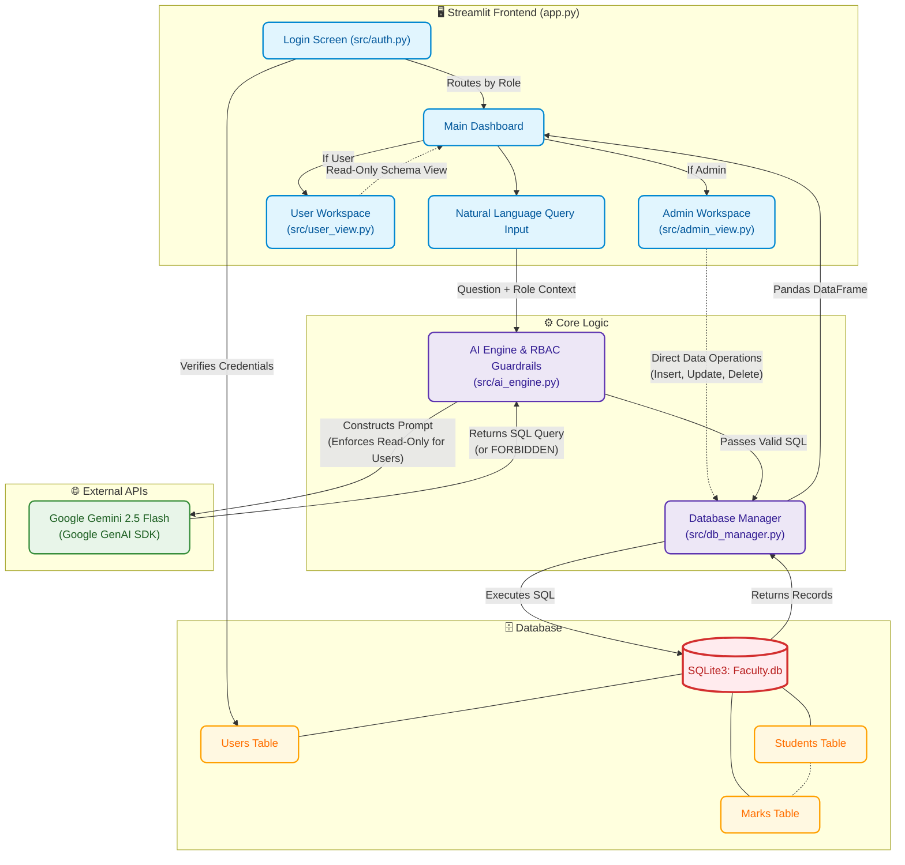

# NexusSQL AI System Architecture

## Overview
NexusSQL AI is an enterprise-grade Generative AI platform that bridges non-technical business users and relational databases. It translates plain English or Arabic questions into optimized, executable SQL queries with real-time results using Google's Gemini 2.5 Flash model. The application features a robust Role-Based Access Control (RBAC) layer to secure data modifications.

## System Architecture Diagram

## Component Breakdown

### 1. Frontend & User Interface (`app.py`, `admin_view.py`, `user_view.py`)
- **`app.py`**: The main entry point of the Streamlit application. It handles session state, coordinates the login flow, routes users based on their role, and displays the query input and results.
- **`src/auth.py`**: Validates the user's credentials against the `Users` table in the database and assigns a session role (`admin` or `user`).
- **`src/admin_view.py`**: Provides full access capabilities. Admins can view live schema limits and perform direct database modifications (Insert, Update, Delete) via UI controls without writing SQL.
- **`src/user_view.py`**: Restricts the user to a secure read-only mode, providing sample database views for reference while relying entirely on the AI for querying.

### 2. AI Engine & Security (`src/ai_engine.py`)
- Acts as the translation layer between plain text and SQL.
- Constructs a highly contextual prompt for **Gemini 2.5 Flash** containing the target database schema (`Students` and `Marks` tables).
- **Role-Based Access Control (RBAC):** Dynamically alters the instructions based on the user's role. If a `user` attempts a destructive command (e.g., `DROP`, `DELETE`), the LLM is instructed to bypass generation and return a strict `FORBIDDEN` flag.

### 3. Database Management (`src/db_manager.py` & `db.py`)
- **`db.py`**: A one-time setup script that drops old tables, creates the schemas (`Students`, `Marks`, `Users`), and seeds the database with initial records to support immediate testing.
- **`src/db_manager.py`**: A centralized connection manager that receives raw SQL queries, connects to `Faculty.db`, executes the operations securely, and returns tuples of data back to the Streamlit frontend.

### Data Flow Execution
1. A user asks: *"Give me the marks of Ahmed Akram."*
2. The UI sends this to `ai_engine.py` along with the user's role.
3. The engine builds a prompt mapping schema relationships and sends it to **Gemini**.
4. Gemini translates this into: `SELECT Marks.Subject, Marks.Score FROM Marks JOIN Students ON ...`
5. The UI calls `db_manager.py` to execute the SQL.
6. The returned data is wrapped in a Pandas DataFrame and rendered on the Streamlit dashboard.
